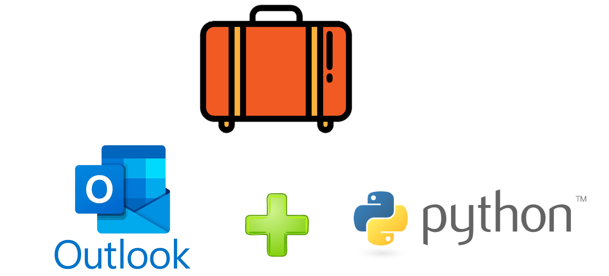

# "Mala direta" com Python usando o cliente de e-mail Outlook



## Motivação:

Precisei enviar diversos certificados que foram gerados em um sistema de fora, e não vindo de um arquivo de layout de certificado, com campos editáveis com rótulos de mala direta (como no Word, por exemplo). E os anexos eram todos diferentes, visto que eram certificados emitidos para pessoas especificas.

Use este script caso você queira enviar emails automatizados com anexos diferentes para cada destinatário usando o cliente de email Outlook (Deve estar instalado e configurado, funcionando corretamente para envio de emails).

**ATENÇÃO:** _Este script depende do cliente de email corretamente instalado e configurado para que funcione corretamente, pois ele envia comandos ao cliente de email que por sua vez se encarrega de enviar as mensagens._

## Instruções gerais sobre o script:

Como base de dados esse script utiliza o formato **_.csv_** no lugar de uma planilha Excel. Basta salvar o arquivo como _.csv_ **tipo: ANSI**.
Você pode adicionar mais colunas ao arquivo conforme desejar. **Por padrão há duas colunas: Nome e Email** e o separador, delimitador é o ponto e vírgula (**;**) pois em português usamos a vírgula como separador decimal e não o ponto. Você pode modificar o delimitador para vírgula alterando o parâmetro de leitura do .csv assim como a codificação: (ANSI, UTF-8...). E no caso de acrescentar mais colunas ao CSV será necessário capturar esses valores no dataframe modificando os comandos relacionados a localização de linhas e colunas no Pandas:

```python

#Lendo a base de dados em CSV:
bdEmail = pd.read_csv("bd.csv",sep=";",encoding = "ANSI", engine='python')
numeroLinhasBdEmail = bdEmail["Nome"].count()
print(f" Número total de linhas importadas 
do CSV: {numeroLinhasBdEmail}")

(...)

#Variáveis para os parâmetros do email:

nomeCompletoDestinatario =  bdEmail["Nome"].loc[i]
primeiroNomeDestinatario = nomeCompletoDestinatario[0: nomeCompletoDestinatario.index(' ')]
emailDestinatario = bdEmail["Email"].loc[i]
assunto = "Parabéns Educador Certificado Microsoft do Século XXI"

```

## Bibliotecas utilizadas

Este script usa as bibliotecas (Precisarão ser instaladas no Python):

- pandas
- pywin32
- os

você pode usar o gerenciador de pacotes do Python para instalá-las, digitando no terminal do SO Windows (com o Python instalado) os comandos:

```python

pip install pandas

pip install pywin32

```

## Como utilizar o script:

### Modificando o assunto do email:

Abra o arquivo: "script.py" e localize a variável chamada: **_"assunto"_** onde contém um texto que será o assunto do email. Modifique conforme o assunto que deseja que tenha o seu email.

### Escrevendo o corpo do email:

Dentro do arquivo "script.py" localize a variável **_"email.HTMLBody"_** **dentro do espaço entre as três aspas duplas do início e do fim do texto, digite seu texto.** (Lembrando que para haver quebra de linha, é preciso adicionar as tags html de quebra de linha e/ou parágrafo:

Exemplo:

```html
<p>Mensagem que quero que fique em um parágrafo</p>
```

### Editando e/ou Adicionando anexos:

**Obs.:** _Se não houver arquivos para anexar, verifique se as linhas de código sobre anexos estão comentadas, ou seja, começam com o símbolo: "**#"**_

Copie os os arquivos de anexos para a pasta chamada: "anexos" e adicione quantos desejar no script, copiando e colando os comandos a seguir editando o: **_"nome_do_anexo"_** para o nome do anexo que deseja enviar, que deve estar dentro da pasta anexos:

```python
anexo = os.path.abspath(f"anexos/nome_do_anexo.pdf")
email.Attachments.Add(anexo)
```
Após isso basta colar no arquivo de script: "script.py", **na linha com o comentário: _"Área de anexo"_** 

**Obs.:** _Verifique se precisa descomentar a linha_ (apagar o símbolo do cerquilha/sustenido/hashtag ou ainda conhecido por jogo da velha, que é usado para comentar linhas no Python. Linhas comentadas não são executadas).

Rode o script chamando dentro da pasta do script:

```python
python script.py
```

Espero que tenha sido útil!